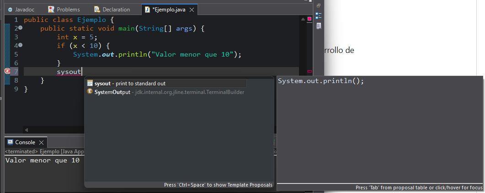

# DAM2526_ED_P3_PreferenciasEditor
## Configuración del Editor de Eclipse.

### 1. Opciones Generales

Se nos pide que activemos la opción Matching Bracket para poder resaltar la llave de un if:

  Podemos observar que está función es muy útil ya que podemos ver dónde termina una llave o paréntesis sin necesidad de buscarlo manualmente, cosa que hacer perder mucho tiempo.

### 2. Save Actions

Se nos pide activar las opciones Format source code y Organize imports para luego desordena el código y apretar Ctrl + S:

  Como podemos observar, la opción Format source code se encarga de dar un formato al código para que sea más legible, mientras que Organize imports se encarga de ordenar, optimizar y limpiar las importaciones del código.

 ### 3. Content Assist

     
Se nos pide modificar la opción Auto activation delay(ms) y configurarla a 1000. Luego, debemos escribir System. y mostrar la lista de sugerencias:

  Como podemos observar, la opción se encarga de detener la ejecución del programa en una cantidad de milisegundos (ms) que viene indicada en el paréntesis, en este caso, 1000. Con esto dicho, esta función sirve para ralentizar la ejecución del programa para poder observarlo y pensarlo mejor, pero en mi opinión , pienso que es mejor dejarlo en cero para que podamos ver el resultado rápidamente y así trabajar más eficientememte.

### 4. Syntax Coloring

  Se nos pide cambiar el color de los comentarios y de las palabras clave (excepto return) pero sin aplicar el cambio:

  

  Como podemos observar, la configuración de colores permite distinguir visualmente entre los distintos elementos del código. Con esto dicho, esta personalización sirve para facilitar la lectura y comprensión del código, ya que mejora el contraste visual. Sin embargo, en mi opinión, pienso que es importante no exagerar con los colores, ya que un exceso de contraste puede resultar molesto o confuso.

  ### 5. Mark Ocurrences

     
Se nos pide desactivar la opción Mark Ocurrences, luego pulsar Ctrl + Shift + U sobre una variable para resaltar todas las veces que se haya usado esa variable. Por último, hacemos una captura a la vista Search:

Como podemos observar, la opción Mark Occurrences se encarga de resaltar automáticamente todas las apariciones de una variable. Esto ocurre de forma sin necesidad de hacer ninguna acción adicional. En cambio, la opción Search References requiere que el usuario presione una combinación de teclas (Ctrl + Shift + U) para realizar una búsqueda manual de todas las referencias del elemento seleccionado dentro del proyecto.

 ### 6. Typing

     
  Se nos pide activar la opción Auto close, escribir un bloque if y mostrar como Eclipse completa los símbolos:

  

Como podemos observar, las funciones de Auto close permiten que Eclipse cierre automáticamente paréntesis, comillas y llaves cuando las abrimos al escribir código. Con esto dicho, estas ayudas sirven para evitar errores comunes como olvidar cerrar un símbolo, lo cual puede causar errores de compilación o mal funcionamiento del programa.

  ### 7. Templates

     
Se nos pide escribir sysout y usar Ctrl + Espacio para insertarla:

Como podemos observar, las plantillas son fragmentos de código predefinidos que se insertan automáticamente al escribir una palabra clave seguida de Ctrl + Espacio. Con esto dicho, estas plantillas sirven para ahorrar tiempo y escribir código más rápido, ya que completan estructuras comunes sin tener que escribirlas por completo.
La ruta donde se gestiona todo esto es: Window > Preferencias > Java > Editor > Templates

  ### 8. Conclusión

      
Como podemos observar, todas las opciones vistas en esta práctica tienen funciones que mejoran el desarrollo en Eclipse, pero en mi caso, la opción que considero más útil es Format source code junto con Organize imports. Con esto dicho, estas herramientas sirven para mantener el código limpio, ordenado y fácil de leer, lo que es fundamental cuando los proyectos se vuelven más grandes o cuando se trabaja en equipo. En mi opinión, pienso que estas funciones me pueden ayudar mucho porque me ahorran tiempo al evitar que tenga que alinear manualmente el código o buscar dónde termina una llave, además de eliminar importaciones innecesarias que solo generan confusión. Gracias a esto, puedo concentrarme más en programar y menos en tareas repetitivas. 
